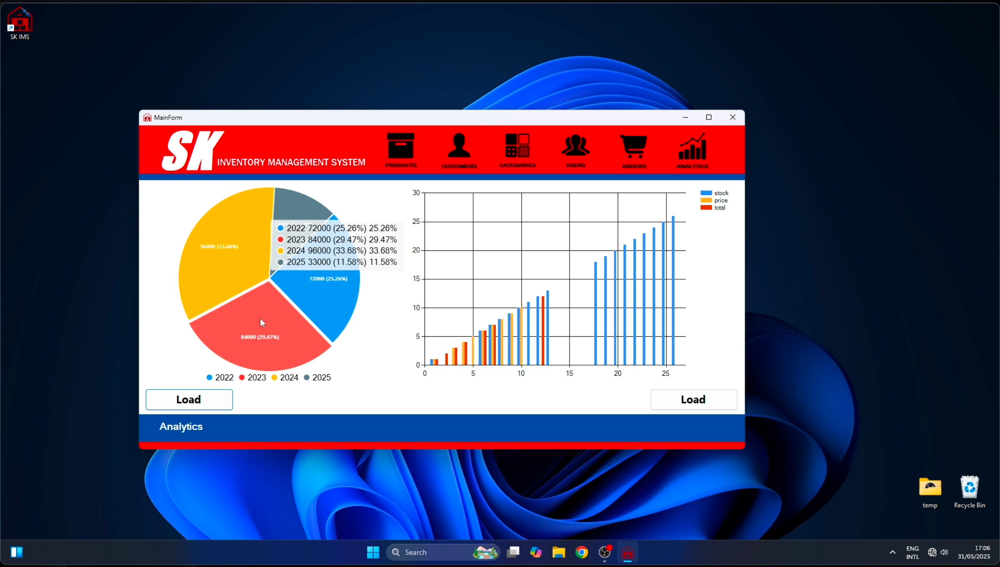

# Project Management System 🗂️

A C# WinForms-based inventory management system built by Group AC for the CS107.3 course.
It manages products, orders, customers, users, and provides useful analytics for an electronics store.

---

## 🚀 Features

- 🔹 Admin login system with authentication
- 🔹 Product management (Add, Edit, Delete, Search)
- 🔹 Customer records with ID, name, and contact
- 🔹 Category filtering for better product organization
- 🔹 Admin/user management (Add new admins)
- 🔹 Order management with live calculations and monthly totals
- 🔹 Visual analytics with pie and bar charts (Revenue, stock, etc.)
- 🔹Fast search functions in all main sections.

---

## 🛠️ Built With

- **C# (.NET Framework)**
- **WinForms**
- **SQL Server / LocalDB**
- **Visual Studio**
- **Git + GitHub**

---

## 📸 Screenshots

<!-- **🔐 Login Page**
 -->

**📦 Orders Tab**


**📊 Analytics View**


---

## 📂 Project Structure
> .

---

## 🔧 Setup Instructions

1. **Clone this repo:**
   ```bash
   git clone https://github.com/nschandunu/InventorySystem-CSharp

2.	Open in Visual Studio
	-	Ensure .NET Framework is installed
	-	Restore NuGet packages if prompted

3.	Configure Database
	-	Place the provided dbIMS.mdf file in the D:\ drive.
	-	Update the connection string in App.config or your database handler class to point to:
    ```bash
     Data Source=(LocalDB)\MSSQLLocalDB;AttachDbFilename=D:\dbIMS.mdf;Integrated Security=True
  - Ensure SQL Server LocalDB is installed and running.

4.	Run the App
	-	Press F5 in Visual Studio to launch

4.	Login Credentials
	-	Username: admin
	-	Password: admin
---
📎 Notes

	•	Developed as part of the CS107.3 course assignment
	•	Designed for managing stock in an electronics retail store
	•	Analytics tab includes yearly revenue and live stock visualizations

